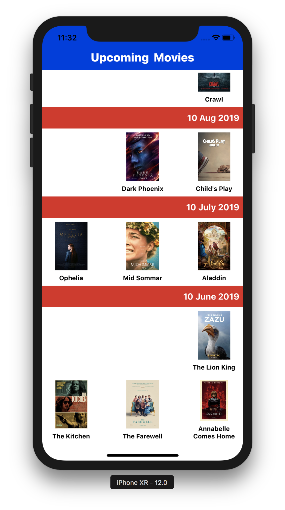

# MovieiOS
FirebaseDemo iOS App<br/>
This app is the solution for below assignment<br/>
**Problem statement:**<br/>
```
1.By default UICollectionView has vertical layout where cells populate from Top-Left. How do we
make it populate data from bottom-right instead.<br/>
2.Data to be loaded dynamically from Firebase realtime DB.<br/>
```
**Solution:**<br/>
```
1.This project will load the upcoming movie list in the collectionview having release date as collectionview header title<br/>
2.The collectionview populates the data from bottom-right<br/>
3.I have put some random data in my Firebase database<br/>
4.MVC designing pattern is used<br/>
```

**How to run?:**<br/>
```
Open the Movie.xcworkspace file<br/>
Run the project
```
**Screenshot:**<br/>

